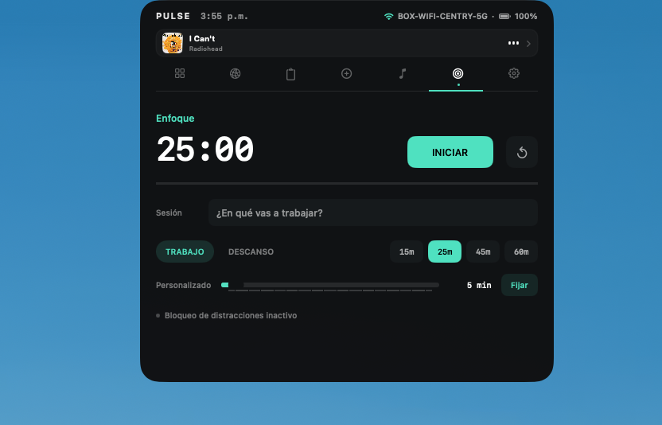
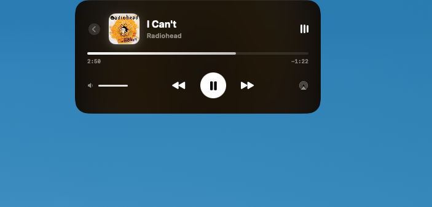
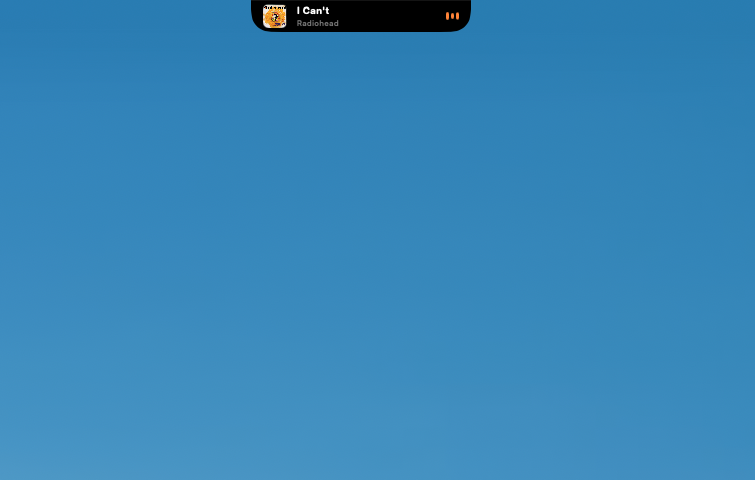
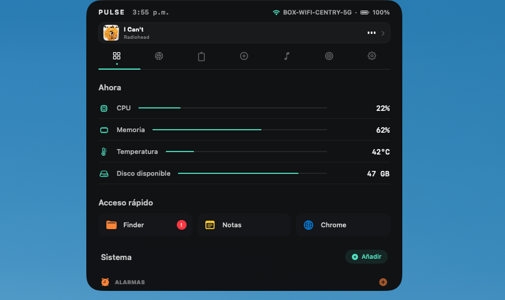
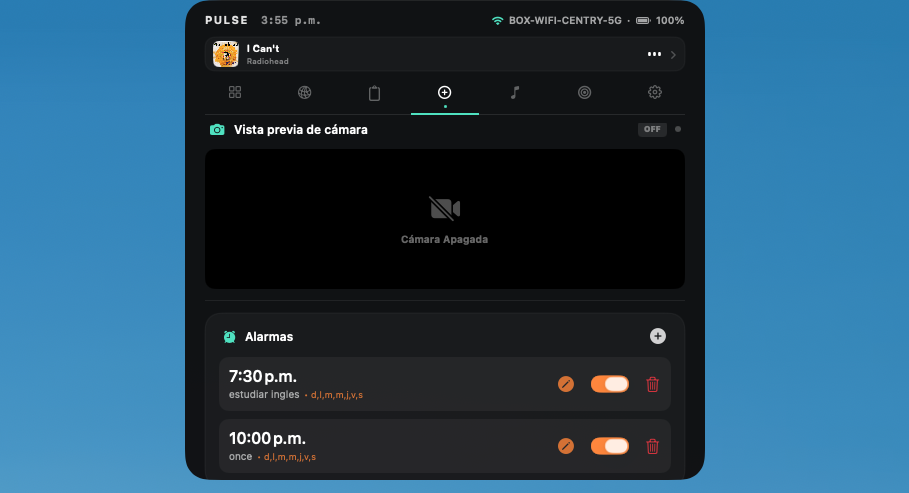
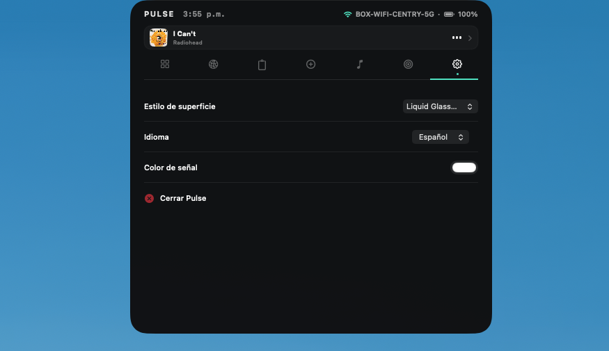

# 🏝️ PULSE - Dynamic Island for macOS

**PULSE** trae la experiencia de la Isla Dinámica de iOS a tu Mac, integrando widgets interactivos, controles de medios, temporizadores pomodoro y más, directamente sobre tu notch o barra de menús.


---

## 🚀 Instalación

### Opción 1: Homebrew (Recomendado)
La forma más fácil y rápida de mantener PULSE actualizado.

```bash
# Agrega el repositorio de fórmulas
brew tap SirAgus/tap

# Instala la aplicación
brew install --cask pulse
```

### Opción 2: Descarga Manual
1. Ve a la sección de [Releases](https://github.com/SirAgus/Pulse/releases).
2. Descarga el archivo `PULSE.dmg`.
3. Arrastra **PULSE.app** a tu carpeta de **Aplicaciones**.

---

## 🛡️ Permisos Requeridos
Para funcionar correctamente, PULSE te pedirá los siguientes permisos en el primer inicio:

*   **Accesibilidad**: Necesario para detectar el tamaño de las ventanas y posicionar la isla correctamente bajo el notch.
*   **Calendario**: Para mostrar tu próximo evento en el widget de calendario.
*   **Bluetooth**: Para listar tus dispositivos conectados (auriculares, ratón, etc.).
*   **Ubicación**: Requerido por macOS para poder leer el nombre (SSID) de tu red WiFi actual.
*   **Eventos de Apple (AppleScript)**: Para controlar apps como Music o Spotify (Play/Pause, Volumen).

---

## ⚠️ Solución al Error "App Dañada"
Si descargas la app **manualmente** (sin Brew), macOS mostrará un aviso de seguridad diciéndote que la app está dañada. **No está dañada**, simplemente no está firmada por Apple.

**Para solucionarlo, ejecuta esto en tu Terminal:**
```bash
xattr -cr /Applications/PULSE.app
```

*Si instalaste mediante **Homebrew**, este paso ya se realizó automáticamente.*

---

## ✨ Características
*   🎵 **Controles de Música**: Compatible con Music y Spotify.
*   ⏱️ **Temporizador Pomodoro**: Gestiona tus sesiones de enfoque.
*   ⏰ **Gestión de Alarmas**: Crea y edita alarmas rápidamente.
*   📊 **Widgets de Sistema**: Monitoriza CPU, Memoria, Batería y WiFi.
*   📋 **Portapapeles**: Historial reciente de tus items copiados.

---

## 📸 Capturas de Pantalla

### Enfoque
| Configuración de sesión | Sesión compacta |
| :---: | :---: |
|  |  |

| Finalización compacta | Finalización expandida |
| :---: | :---: |
|  |  |

### Música
| Reproductor expandido | Reproductor compacto |
| :---: | :---: |
|  |  |

### Sistema y personalización
| Aplicaciones y widgets | Cámara y alarmas | Configuración |
| :---: | :---: | :---: |
|  |  |  |


---

## 🛠️ Para Desarrolladores
Si quieres contribuir o compilar el proyecto tú mismo, consulta la [Guía de Lanzamiento](RELEASE_GUIDE.md).

---

**Hecho con ❤️ por [SirAgus](https://github.com/SirAgus)**
